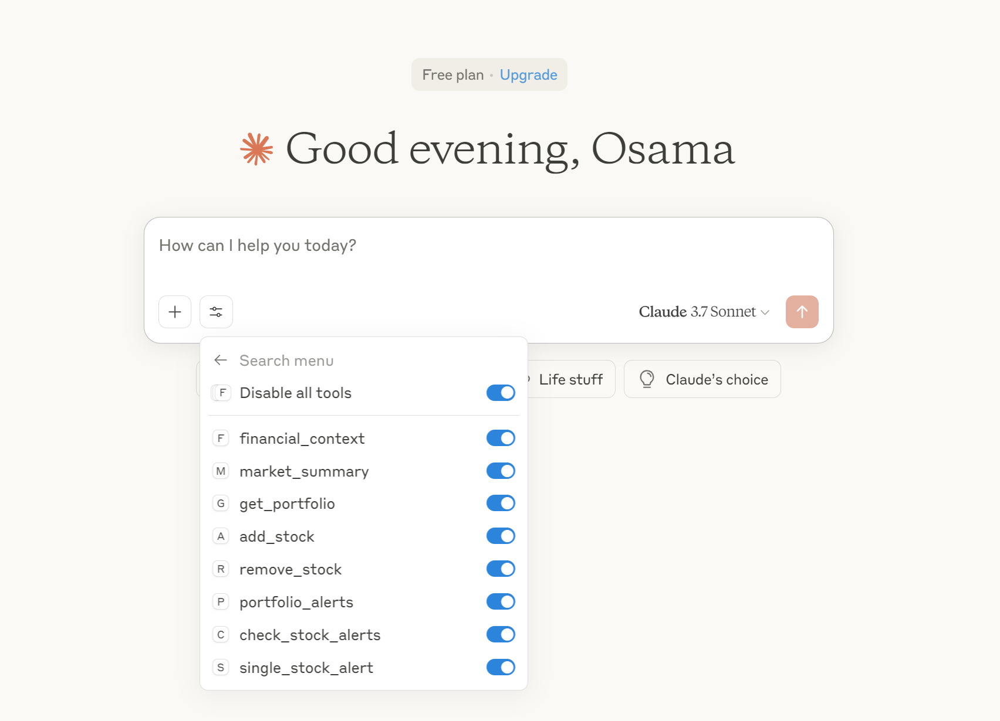

# Financial MCP Server

<p align="center">
  <a href="https://portal.azure.com/#create/Microsoft.Template/uri/https%3A%2F%2Fraw.githubusercontent.com%2Fosamadev%2Ffinancial_mcp_server%2Fmain%2Fazuredeploy.json">
    
  </a>
</p>

A custom Model Context Protocol (MCP) server for advanced financial analysis, stock monitoring, and real-time market intelligence. This server provides a suite of tools and API endpoints for portfolio management, market summaries, stock alerts, and contextual financial insights, designed for seamless integration with Claude Desktop and other MCP-compatible clients.

---

## One-Click Cloud Deploy

Use the deployment buttons and platform manifests in [`DEPLOY.md`](DEPLOY.md)
to launch a remotely hosted MCP endpoint over HTTPS (`https://.../mcp`) on
Azure, Render, or Cloudflare Worker proxy.

[](https://portal.azure.com/#create/Microsoft.Template/uri/https%3A%2F%2Fraw.githubusercontent.com%2Fosamadev%2Ffinancial_mcp_server%2Fmain%2Fazuredeploy.json)
[](https://render.com/deploy?repo=https://github.com/osamadev/financial_mcp_server)
[](https://deploy.workers.cloudflare.com/?url=https://github.com/osamadev/financial_mcp_server/tree/main/cloudflare-worker)

- Local default: `MCP_TRANSPORT=stdio` (Claude Desktop / local MCP clients)
- Cloud default in container manifests: `MCP_TRANSPORT=streamable-http`
- Secure HTTP default: set `MCP_ACCESS_TOKEN` and send `Authorization: Bearer <token>`

---

## Key Features

- **Core Stock Toolkit**: Quotes, company overview, and price history tools for practical analysis workflows.
- **Portfolio With Live Values**: Maintain a watchlist/positions store and return portfolio-level valuation context.
- **Configurable Price Alerts**: Set per-ticker `above` / `below` thresholds and evaluate triggered alert events.
- **News + Context Layer**: Retrieve market news and optional sentiment-rich context summaries for research workflows.
- **Secure Streamable HTTP**: Bearer-token authentication support for public deployments using `MCP_ACCESS_TOKEN`.
- **Cloud-Ready Deployment**: Docker + one-click manifests for Azure Container Apps, Render, and Cloudflare Worker proxy.

---

## System Overview

### Core Endpoints & Tools

- **get_stock_quote(ticker: str)**
  - Returns normalized live quote data (price, change, market cap, volume, exchange, timestamp).
- **get_price_history(ticker: str, period: str, interval: str)**
  - Returns chart-ready OHLCV history points for backtesting and trend analysis.
- **get_company_overview(ticker: str)**
  - Returns company profile metadata and key valuation fields when available.
- **get_portfolio()**
  - Returns positions/watchlist plus live quote enrichment and portfolio market value summary.
- **add_stock(...)** / **remove_stock(...)**
  - Add or remove symbols in the persistent portfolio store.
- **set_stock_alert(ticker, above=None, below=None)** / **get_portfolio_alerts(ticker=None)**
  - Configure and evaluate price-threshold alerts from portfolio-backed rules.
- **get_stock_news(ticker_or_query, max_results=5)** and **financial_context(query)**
  - Provide raw financial headlines and optional LLM-ready context summaries.

### Automated Alerting
- **Telegram Integration**: Sends formatted alerts and summaries to a configured Telegram chat.
- **Trading Opportunities**: Detects and notifies about actionable trading signals.

### Contextual Summarization
- **News Summarizer**: Uses a local LLM (Ollama/Mistral) to generate detailed, sentiment-tagged summaries of financial news articles.
- **Prompt Builder**: Constructs a market-aware prompt for use in downstream LLMs or assistants.

---

## File Structure

```
config/
  alerts_config.json         # Main alert configuration (sector/ticker/thresholds)
  tech_alerts_config.json    # Tech sector-specific alerts
services/
  alerts.py                  # Core alert logic
  tech_alerts.py             # Tech sector alert logic
  telegram_alerts.py         # Telegram integration
  market_summary.py          # Market data and news
  summarizer.py              # News summarization (LLM)
  fetcher.py                 # Web data fetching
  context_builder.py         # Prompt/context construction
  intent_parser.py           # Financial entity extraction
  portfolio.py               # Portfolio management
server.py                    # MCP server entry point and API definitions
requirements.txt             # Python dependencies
```

---

## Configuration & Customization

### Alert Configuration (`config/alerts_config.json`)

- Organize stocks by sector, with customizable upper/lower price thresholds and descriptions.
- Example structure:

```json
{
  "Tech Giants": {
    "AAPL": {"above": 200, "below": 180, "description": "Apple Inc."}
  },
  "Financial": {
    "JPM": {"above": 160, "below": 140, "description": "JPMorgan Chase"}
  }
}
```

### Environment Variables

Set these in a `.env` file or your system environment:

```
MCP_TRANSPORT=stdio
HOST=0.0.0.0
PORT=8000
LOG_LEVEL=INFO
MCP_ACCESS_TOKEN=replace_with_strong_secret_for_http
TELEGRAM_BOT_TOKEN=your_bot_token
TELEGRAM_USER_ID=your_chat_id
SERPAPI_API_KEY=your_serpapi_key
OLLAMA_HOST=http://localhost:11434
OLLAMA_MODEL=mistral
# Optional: set true only for local streamable-http tests
# ALLOW_UNAUTHENTICATED_HTTP=false
# Optional: send Telegram notifications when alerts trigger
# ENABLE_TELEGRAM_ALERTS=false
# Optional persistent path for portfolio file in cloud
# PORTFOLIO_FILE=/data/user_portfolio.json
```

---

## Installation & Running from Claude Desktop

### Prerequisites
- Python 3.7+
- [Claude Desktop](https://www.anthropic.com/claude-desktop) (or any MCP-compatible client)
- Telegram bot credentials (for alerting)
- Internet connection (for market/news data)

### Step-by-Step Guide

1. **Clone the Repository**
   ```bash
   git clone <this-repo-url>
   cd Finance_MCP_Server
   ```

2. **Create and Activate a Virtual Environment**
   ```bash
   python -m venv .venv
   source .venv/bin/activate  # On Windows: .venv\Scripts\activate
   ```

3. **Install Dependencies**
   ```bash
   pip install -r requirements.txt
   ```

4. **Configure Environment Variables**
   - Create a `.env` file in the project root with your API keys and tokens:
     ```
     TELEGRAM_BOT_TOKEN=your_bot_token
     TELEGRAM_USER_ID=your_chat_id
     SERPAPI_API_KEY=your_serpapi_key
     MCP_ACCESS_TOKEN=replace_with_strong_secret_for_http
     ```

5. **Edit Alert Configurations**
   - Modify `config/alerts_config.json` and `config/tech_alerts_config.json` to set your stocks, sectors, and thresholds.

6. **Install the MCP Server with the CLI**
   - Use the MCP CLI to install and register the server for Claude Desktop:
     ```bash
     mcp install server.py --name "Financial MCP Server"
     ```
   - This will register the server as a custom MCP tool, making it discoverable by Claude Desktop and other MCP clients.

7. **Run the MCP Server via MCP CLI**
   - Start the server using the MCP CLI:
     ```bash
     mcp run server.py
     ```
   - The server will start and listen for MCP requests via stdio.

8. **Connect from Claude Desktop**
   - In Claude Desktop, add a new custom MCP server connection.
   - Set the executable/command to `mcp run server.py` (or select the registered "Financial MCP Server" from the MCP CLI list).
   - Claude Desktop will communicate with the server using the MCP protocol, enabling all the described tools and endpoints.

---

### Example: Claude Desktop MCP Server Configuration

After installing and registering the Financial MCP Server, you can add it to your Claude Desktop configuration. Here is a sample `claude_desktop_config.json` snippet:

```json
{
  "mcpServers": {
    "Financial-MCP-Server": {
      "command": "uv",
      "args": [
        "run",
        "--with",
        "mcp[cli]",
        "mcp",
        "run",
        "server.py"
      ],
      "env": {
        "SERPAPI_API_KEY": "",
        "TELEGRAM_BOT_TOKEN": "",
        "TELEGRAM_USER_ID": "",
        "OPENAI_API_KEY": "",
        "ALPHA_VANTAGE_API_KEY": ""
      }
    }
  }
}
```

- Update the `env` section with your actual API keys and tokens as needed.
- This configuration ensures Claude Desktop can launch and communicate with your Financial MCP Server using the correct environment and command-line arguments.

---

## Using Your Tools in Claude Desktop

After installing and connecting your custom Financial MCP Server, all available tools will automatically appear in Claude Desktop's tool menu. You can enable or disable each tool individually, making it easy to access functionalities such as financial context analysis, market summaries, portfolio management, and stock alerts directly from the Claude interface.

Below is a screenshot showing how the tools from your MCP server will be listed and toggled in Claude Desktop:



- Each tool (e.g., `financial_context`, `market_summary`, `add_stock`, etc.) can be enabled or disabled as needed.
- This seamless integration allows you to interact with your financial analysis server using natural language and tool-based workflows within Claude Desktop.

---

## Usage Examples

- **Get Live Quotes**: Use `get_stock_quote` and `get_company_overview` for practical stock checks.
- **Track Portfolio**: Use `add_stock`, `remove_stock`, and `get_portfolio` to maintain and value your watchlist.
- **Evaluate Alerts**: Use `set_stock_alert` and `get_portfolio_alerts` for threshold-based signals.
- **Contextual Analysis**: Use `financial_context` to fetch and summarize market context for a query.

---

## Troubleshooting & Logs

- All logs are written to `financial_mcp.log` in the project root.
- For debugging, check the log file and ensure your environment variables and configuration files are correct.
- If you encounter issues with Telegram or news fetching, verify your API keys and internet connection.

---